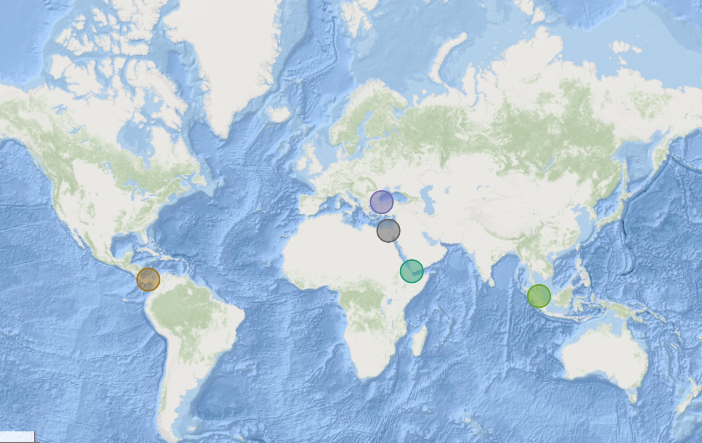
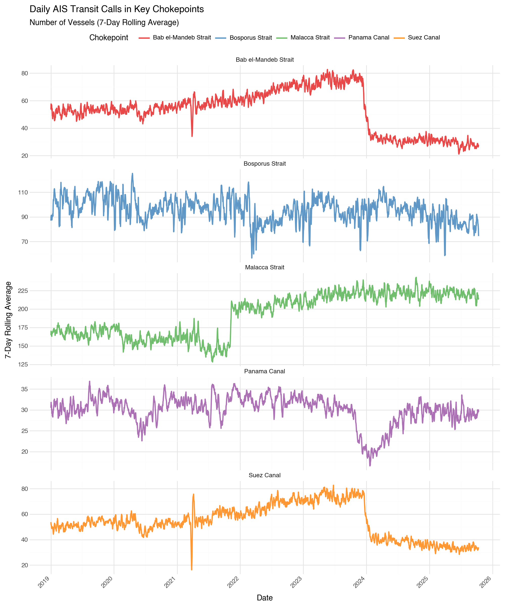
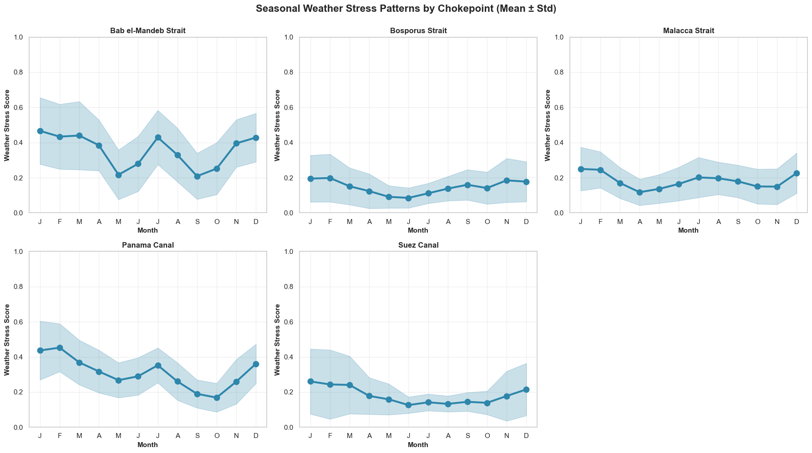
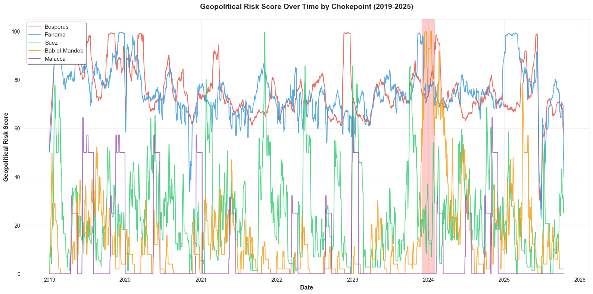
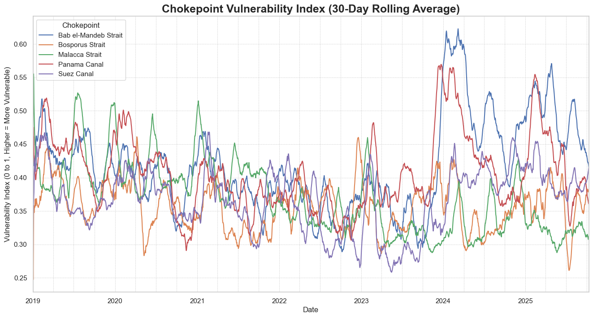
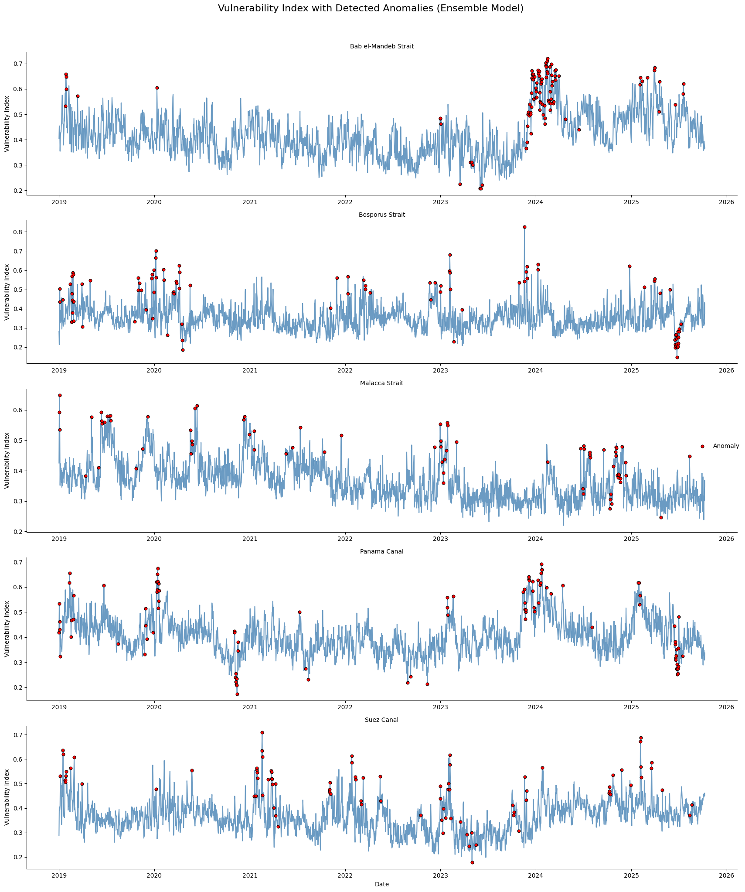
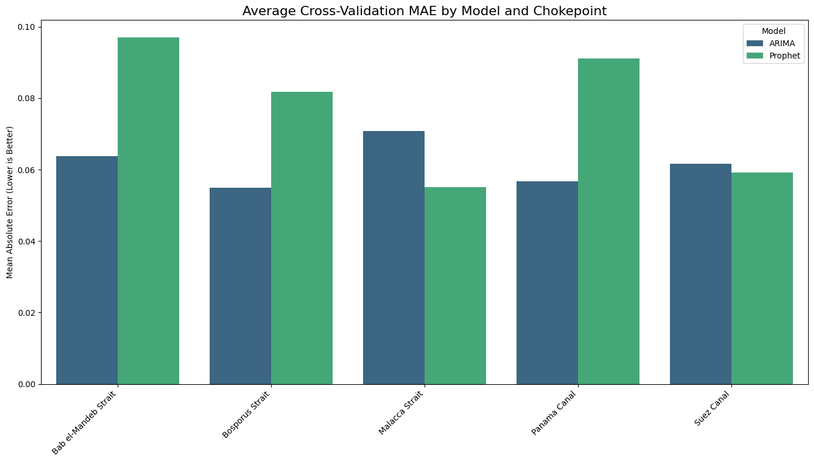
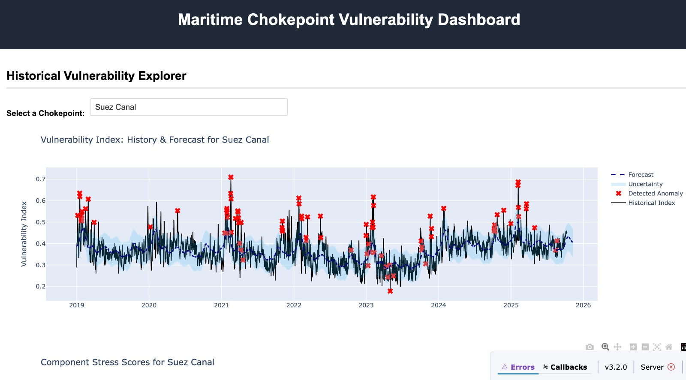
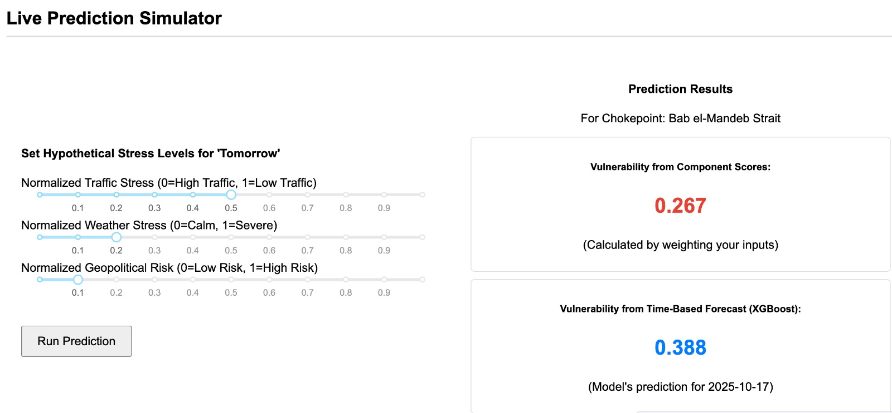

# Maritime Chokepoints Risk Analysis

## Project Overview

The global economy is critically dependent on a handful of maritime chokepoints. Disruptions, as exemplified by the 2021 Ever Given incident in the Suez Canal, can trigger massive economic consequences, yet analysis of these locations remains largely reactive. This project addresses a significant gap by developing a proactive, near real-time system to monitor the operational health and stress levels of these critical arteries of trade.

The core objective is to answer the question: **Can we create a near real-time "Vulnerability Index" for major maritime chokepoints by fusing public data on ship movements, severe weather, and regional geopolitical events?**

This framework moves beyond single-source analysis to create a holistic, weighted index that quantifies daily stress. The project culminates in an analytical pipeline that not only detects historical anomalies but also forecasts future vulnerability, all presented in an interactive dashboard for strategic decision-making.



---

## Technical Architecture & Methodology

This is a data science project that integrates multiple domains: big data engineering, geospatial analysis, time-series analysis, and machine learning. The entire workflow is built on a custom, code-based pipeline using Python and its data science ecosystem.

**Module Stack:**
*   **Data Acquisition:** `requests`, `cdsapi` (Copernicus Climate Data Store API), `google-cloud-bigquery` (for GDELT data download)
*   **Data Processing & Analysis:** `pandas`, `numpy`, `geopandas`, `xarray`, `scikit-learn`
*   **Machine Learning & Forecasting:** `tensorflow` (for LSTM Autoencoder), `statsmodels` (for ARIMA), `prophet`, `xgboost`
*   **Visualization & Dashboarding:** `matplotlib`, `seaborn`, `plotnine`, `plotly`, `dash`

### Stage 1: Multi-Source Data Acquisition and Processing

A significant effort was dedicated to collecting and processing vast, disparate datasets from multiple sources.

1.  **Maritime Traffic (AIS Data):** Daily transit data for five key chokepoints (Suez Canal, Panama Canal, Bab el-Mandeb Strait, Malacca Strait, Bosporus Strait) was sourced from the PortWatch ArcGIS service. The pipeline handles API queries, processes JSON responses, and aggregates daily traffic counts by vessel type, resulting in a clean time-series dataset of traffic flow. (https://portwatch.imf.org/)
    *   **Result:** A dataset of **12,385** daily traffic records across the five locations from 2019 to late 2025. EDA revealed the Malacca and Bosporus straits as having the highest average traffic volume, with distinct vessel type compositions for each chokepoint.

    

3.  **Weather (ERA5 Reanalysis):** Using the Copernicus Climate Data Store (CDS) API, hourly data for wind speed and significant wave height was downloaded for a 1x1 degree bounding box around each chokepoint. This complex scientific data (NetCDF format) required a robust pipeline to calculate spatial means and daily maximums, transforming terabytes of raw data into a daily "Weather Stress Score." (https://cds.climate.copernicus.eu/datasets/reanalysis-era5-single-levels)
    *   **Result:** A dataset of **12,375** daily weather stress scores. Analysis showed clear seasonal patterns, with locations like the Bab el-Mandeb and Bosporus Straits exhibiting higher weather volatility.

    

5.  **Geopolitical Events (GDELT):** The GDELT Project, a massive open database monitoring global news, was queried via Google BigQuery. A sophisticated pipeline was built to handle API quotas across multiple service accounts, cache results, and filter billions of global events for those occurring within a specific radius (200-300km) of each chokepoint. Events were filtered for relevance (e.g., conflict, assault, protest) to create a daily "Geopolitical Risk Score." (https://www.gdeltproject.org/)
    *   **Result:** Over **2.1 million** potentially relevant events were collected and processed. After filtering and aggregation, a complete daily time series from 2019-2025 was created. The data clearly captures the dramatic spike in risk for the Bab el-Mandeb Strait in late 2023-2024, corresponding to the Red Sea shipping crisis.

    

### Stage 2: The Unification & Vulnerability Index Creation

The three cleaned and processed data streams (Traffic, Weather, Geopolitical) were merged into a single, unified master time series. This stage involved careful temporal alignment and feature engineering to create the final **Vulnerability Index**.

1.  **Feature Normalization:** To make the components comparable, each was transformed into a normalized stress score:
    *   **Traffic Stress:** Calculated as a negative Z-score, where significantly *lower-than-average* traffic indicates higher stress (e.g., diversions, blockages).
    *   **Geopolitical Risk:** A Z-score was calculated from the raw risk score to measure deviation from the norm for that specific location.
    *   **Weather Stress:** The score was already on a normalized 0-1 scale.

2.  **Weighted Composite Index:** The final Vulnerability Index is a weighted sum of the three normalized components, providing a single, interpretable daily score from 0 to 1.
    *   `Vulnerability Index = (Traffic * 0.35) + (Weather * 0.30) + (Geopolitical * 0.35)`
    *   **Result:** A master dataset of **12,375** daily records, each with a calculated Vulnerability Index. The **Bab el-Mandeb Strait** was identified as the chokepoint with the highest average vulnerability, primarily driven by the geopolitical component. The most vulnerable day recorded in the entire dataset was **January 12, 2024, for the Bab el-Mandeb Strait**, with a score of **0.825**, rated as "Critical".



### Stage 3: Anomaly Detection

To automatically flag days of unusual stress, an ensemble of three unsupervised machine learning models was trained on the component stress features for each chokepoint. This approach is ideal as we do not have pre-labeled "disruption events."

*   **Models Used:**
    1.  **Isolation Forest**
    2.  **One-Class SVM**
    3.  **LSTM Autoencoder**

*   **Ensemble Approach:** An anomaly is officially flagged if at least **two out of the three models** agree. This reduces false positives and increases the robustness of the detection system.
    *   **Result:** The ensemble model flagged **3.68%** of days across all chokepoints as anomalous. These flags corresponded well with known events and periods of high stress identified in the Vulnerability Index, validating the system's ability to provide early warnings.



### Stage 4: Time-Series Forecasting

To transform the framework from a monitoring tool into a proactive one, a pipeline was developed to forecast the Vulnerability Index 30 days into the future.

*   **Models Compared:**
    1.  **ARIMA**
    2.  **Prophet**

*   **Evaluation:** Time-series cross-validation was performed to select the best model for each chokepoint based on Mean Absolute Error (MAE).
    *   **Result:** Prophet was chosen as the overall best and most stable model for generating the final forecasts, demonstrating strong performance across multiple chokepoints, particularly **Malacca Strait** and **Suez Canal**. The ARIMA model performed best for the others, but Prophet was selected for its robustness and ease of implementation in the final dashboard.



---

## Interactive Dashboard

The project culminates in a live, interactive dashboard built with **Dash** and **Plotly**.

**Features:**
1.  **Historical Explorer:** Users can select any chokepoint to view its complete vulnerability history, including detected anomalies and the 30-day forecast.
2.  **Component Analysis:** A synchronized chart displays the underlying stress drivers (traffic, weather, geopolitical) for any selected period.
3.  **Live Prediction Simulator:** Users can input hypothetical stress levels for "tomorrow" to see an immediate prediction of the Vulnerability Index, allowing for scenario planning.





## Running the Project

Follow these steps to set up the environment and launch the Maritime Vulnerability Dashboard.

### 1. Clone the Repository

First, clone the project repository to your local machine using Git.

```bash
git clone https://github.com/RakeshKomuravelly/Maritime-Chokepoints-Risk-Analysis.git
```

### 2. Create Environment & Install Dependencies

Use a virtual environment to manage project dependencies.

```bash
# Create a virtual environment
python -m venv venv

# Activate the environment
# On Windows:
venv\Scripts\activate
# On macOS/Linux:
source venv/bin/activate

# Install the required packages
pip install -r requirements.txt
```

### 3. Run the Data Processing Pipelines

The dashboard requires the processed data files and trained models. You must run the Jupyter notebooks in sequential order to generate these assets.

**Important:** Run notebooks `01` through `06` in order. Each notebook generates output files that the next one depends on.

*Note: The GDELT and Weather data pipelines may take a significant amount of time to download all the required data.*

### 4. Launch the Interactive Dashboard

Once the pipelines have been executed successfully, you can start the Dash application.

```bash
python dashboard.py
```

After running the command, open your web browser and navigate to the following address to view the dashboard:

[**http://127.0.0.1:8050/**](http://127.0.0.1:8050/)
